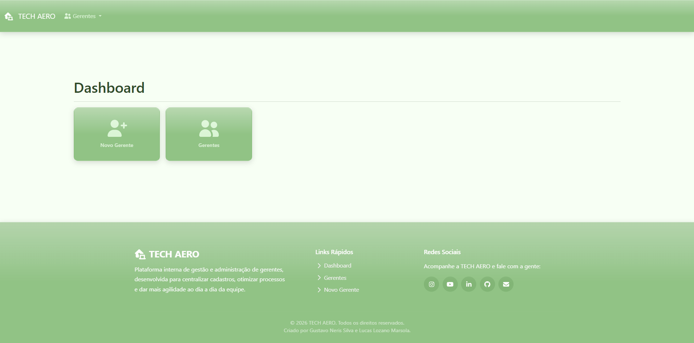

# Sobre o projeto

O **Tech Aero** é um sistema web simples para gerenciamento de funcionários e gerentes, desenvolvido utilizando **PHP, jQuery, HTML5 e CSS3**. O projeto foi criado com o objetivo de praticar o desenvolvimento web, integração com banco de dados e construção de interfaces utilizando o Bootstrap.

O projeto está hospedado na plataforma **InfinityFree**.

## Tecnologias utilizadas

Para o desenvolvimento do projeto, foram utilizadas as seguintes tecnologias e bibliotecas:

* **PHP**
* **HTML5**
* **CSS3**
* **jQuery**
* **Bootstrap 5.3**
* **Font Awesome**

## Design

O design do Tech Aero foi inspirado na estética **Frutiger Aero**, combinando elementos visuais leves e coloridos com uma abordagem moderna e funcional.

A paleta de cores utiliza principalmente tons de **verde pastel**, inspirados visualmente no **Linux Mint**, buscando transmitir uma sensação de leveza, aconchego e simplicidade.

A interface também utiliza elementos translúcidos, gradientes e componentes com aparência suave para reforçar a identidade visual do projeto.

## Algumas imagens do projeto

